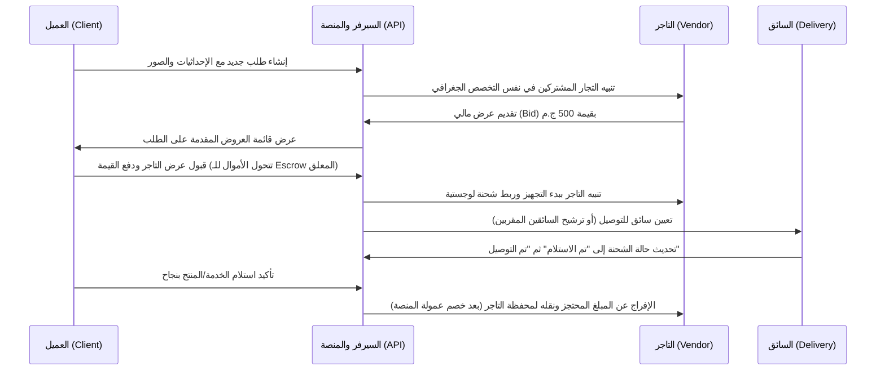

# دليل مشروع شوفلي مصر (Shoofly EGY) - دليل المطورين والوكلاء الذكاء الاصطناعي (AI Agents)

هذا الدليل يمثل الخريطة الشاملة والهيكل البرمجي لمشروع **شوفلي مصر (Shoofly EGY)**. تم تصميمه لتمكين أي وكيل برمجي (Developer Agent) أو مطور بشري من فهم هيكل المشروع، قواعد البيانات، تدفق البيانات المشترك، وتفاصيل الصفحات وطرق تشغيل وفحص التطبيق.

---

## 1. نظرة عامة على المشروع وأدواره الرئيسية
تطبيق **شوفلي** هو منصة مزادات وتوصيل خدمات ولوجستيات تربط بين أربعة أطراف أساسية في السوق المصري بالكامل بلغة عربية (RTL) وهوية بصرية موحدة (Navy, Orange, Green, White):

1. **العميل (Client)**:
   - يطلب الخدمة عبر معالج خطوات (Stepper) مدعوم بتحديد الموقع الجغرافي.
   - يتلقى العروض التنافسية من التجار/الصنايعية ويختار الأنسب له.
   - يتتبع السائق والخريطة مباشرة ويتواصل عبر شات مباشر.
2. **التاجر / مقدم الخدمة (Vendor)**:
   - يرى طلبات العملاء القريبة منه جغرافياً وتصنيفياً.
   - يقدّم عروض أسعار (Bids).
   - يسحب أرباحه ويدير الملف التعريفي والتقييمات.
3. **مندوب التوصيل (Delivery)**:
   - يستلم مهام التوصيل بعد قبول عروض التجار.
   - يشارك موقعه المباشر (GPS Tracking) لتحديث العميل والتاجر.
   - يسجل تسليم المنتجات ومستحقات الشحن.
4. **المدير العام (Admin)**:
   - يراقب النظام بالكامل من خلال لوحة تحكم مركزية (Admin Dashboard).
   - يتابع حركة السائقين المباشرة (Uber-like Fleet Tracking).
   - يفحص طلبات التوثيق (KYC)، الشكاوى (Complaints)، المعاملات المالية (Finance/Escrow)، وطلبات سحب الأموال (Withdrawals).

---

## 2. الهيكل البرمجي للمشروع (Monorepo Directory Layout)

```bash
shoofly-egy/
├── app/                              # مشروع Next.js (App Router)
│   ├── (auth)/                       # صفحات الدخول والتسجيل ونسيان كلمة المرور
│   ├── admin/                        # صفحات لوحة تحكم المدير العام (RTL & Responsive)
│   ├── client/                       # لوحة تحكم العميل وطلب الخدمات ومتابعة العروض
│   ├── vendor/                       # لوحة تحكم التاجر وتقديم العروض المالية
│   ├── delivery/                     # لوحة تحكم السائق وقبول المهام
│   ├── api/                          # واجهات البرمجة الخلفية (API Endpoints)
│   │   ├── admin/                    # عمليات الفحص والشكاوى والتتبع والمالية للمدير
│   │   ├── auth/                     # إدارة الجلسات وتسجيل الدخول والخروج
│   │   ├── client/                   # إنشاء وتحديث طلبات العملاء
│   │   ├── vendor/                   # عروض الأسعار والتوثيق والمالية للتجار
│   │   ├── delivery/                 # تحديث المواقع ومهام التوصيل للسائقين
│   │   └── upload/                   # معالجة رفع الملفات والصور إلى السيرفر المحلي/السحابة
│   ├── globals.css                   # إعدادات Tailwind وتخصيص خط Cairo/Tajawal والستايل العام
│   ├── layout.tsx                    # المخطط العام وتطبيق الـ Theme والملاحة السفلية للموبايل
│   └── page.tsx                      # صفحة الهبوط الرئيسية للعملاء (Landing Page)
├── components/                       # المكونات البرمجية المشتركة (React Components)
│   ├── admin/                        # مكونات لوحة تحكم الإدارة (الخرائط، الجداول المتجاوبة)
│   ├── landing/                      # أجزاء صفحة الهبوط والملاحة السفلية للموبايل
│   ├── shoofly/                      # عناصر الواجهة المخصصة (أزرار، مدخلات، خريطة MapPicker)
│   └── ui/                           # المكونات التأسيسية القابلة لإعادة الاستخدام (تكامل shadcn)
├── lib/                              # مكتبات المساعدة والخدمات والمنطق الداخلي
│   ├── api/                          # دوال استدعاء الـ APIs للفرونتد
│   ├── auth.ts                       # منطق الـ JWT واستخراج بيانات الجلسة من الكوكيز
│   ├── db.ts                         # إعداد Prisma Client
│   ├── google-maps-loader.ts         # تهيئة وإعداد خرائط جوجل والأنماط المخصصة للعلامات
│   └── services/                     # منطق الأعمال الأساسي بقاعدة البيانات (Services Layer)
├── mobile/                           # تطبيقات الموبايل الهجينة (Flutter/Dart)
│   ├── shoofly_client/               # تطبيق العميل للهواتف الذكية
│   ├── shoofly_vendor/               # تطبيق التجار لتقديم العروض واستلاف التنبيهات
│   └── shoofly_core/                 # منطق الأعمال والـ BLOCs المشتركة لجميع التطبيقات
├── prisma/                           # ملفات قاعدة البيانات وهيكلتها
│   ├── schema.prisma                 # النموذج المفصل للعلاقات والجداول (Schema.prisma)
│   └── seed-consolidated.ts          # بيانات التهيئة الأساسية للمطورين والبيانات التجريبية
├── scripts/                          # نصوص برمجية للأتمتة والتهيئة
└── tests/                            # ملفات فحص الجودة والاختبارات التلقائية (Integration & UI)
```

---

## 3. تفاصيل الصفحات وراوتات التطبيق (Page Routing Map)

### أ. صفحات المدير العام (`/admin/*`)
*لوحة تحكم معقدة ومحسنة ومتجاوبة بالكامل مع الموبايل عبر فرض شريط تمرير أفقي على الجداول الكثيفة بالبيانات:*
1. `/admin` (الرئيسية): إحصائيات مالية، عدد المستخدمين، ومخططات الأداء السريع.
2. `/admin/users`: إدارة حسابات العملاء والسائقين وحظرهم أو تفعيلهم.
3. `/admin/vendors`: إدارة حسابات التجار ومراجعة بياناتهم وتقييماتهم.
4. `/admin/requests`: مراجعة طلبات الخدمات المفتوحة والمكتملة وإدارتها.
5. `/admin/kyc`: فحص ومراجعة مستندات الهوية والتوثيق المرفوعة من التجار والسائقين.
6. `/admin/complaints`: معالجة وحل الشكاوى المرفوعة من العملاء ضد مقدمي الخدمة.
7. `/admin/finance`: دفتر الأستاذ المالي وحركة المعاملات المباشرة والأموال المعلقة (Escrow).
8. `/admin/refunds`: طلبات استرداد الأموال للعملاء ومراجعتها.
9. `/admin/withdrawals`: طلبات سحب الأموال للتجار والسائقين وتأكيد تحويلها.
10. `/admin/tracking`: تتبع الأسطول المباشر (Fleet Map) يظهر مواقع السائقين والتجار والطلبات النشطة.
11. `/admin/settings`: إدارة العمولات، حدود السحب والأمان، والإعدادات العامة للمنصة.

### ب. صفحات العميل (`/client/*`)
*تجربة مستخدم سريعة وبسيطة تركز على طلب الخدمة ومتابعة التنفيذ:*
1. `/client`: لوحة العميل تظهر الطلبات الحالية والمنتهية.
2. `/client/requests/new`: معالج إضافة طلب جديد من 4 خطوات (تحديد الاسم والتخصص -> رفع الصور -> تحديد الموقع على الخريطة يدويًا أو عبر الـ GPS -> تأكيد الميزانية والنشر).
3. `/client/requests/[id]`: تفاصيل الطلب، ومتابعة عروض التجار واختيار العرض الفائز والدفع للمنصة.
4. `/client/wallet`: عرض رصيد المحفظة وعمليات شحن الرصيد والخصم.
5. `/client/chat`: تواصل مباشر مع التاجر الفائز أو سائق التوصيل لحل تفاصيل الطلب.
6. `/client/profile`: تعديل البيانات الشخصية وكلمة المرور.

### ج. صفحات التاجر (`/vendor/*`)
*أدوات لإدارة المبيعات وتقديم عروض الأسعار بسرعة:*
1. `/vendor`: لوحة التحكم الإحصائية للأرباح والعروض النشطة والمكتملة.
2. `/vendor/requests`: استكشاف طلبات العملاء القريبة جغرافياً لتقديم عروض أسعار عليها.
3. `/vendor/bids`: إدارة العروض المقدمة وحالتها (مقبولة، معلقة، مرفوضة).
4. `/vendor/earnings`: تفاصيل الأرباح التاريخية ومستوى العمولة.
5. `/vendor/withdrawals`: تقديم ومتابعة طلبات سحب الأرباح البنكية أو المحافظ الإلكترونية.

### د. صفحات السائق (`/delivery/*`)
*واجهة مبسطة ومناسبة للعمل الميداني:*
1. `/delivery`: قائمة المهام اللوجستية الموكلة للسائق وتحديث حالتها (جاري الاستلام، جاري التوصيل، تم التسليم).
2. `/delivery/profile`: بيانات السائق ورخصة القيادة ومركبته لتوثيق الحساب.

---

## 4. هيكل قاعدة البيانات والعلاقات البرمجية (Prisma Schema Summary)

العلاقات الأساسية مبنية كالتالي:
*   **User**: يمثل الحساب الرئيسي ويمتلك `role` يحدد صلاحياته (`CLIENT`, `VENDOR`, `DELIVERY`, `ADMIN`). يمتلك علاقة واحدة مع `Wallet` وعلاقة مع مستندات التوثيق `KycDocument`.
*   **Category & Subcategory**: شجرة التصنيفات (مثال: صيانة أجهزة -> تكييفات) مع تحديد هل يحتاج التخصص إلى ماركة تجارية (`requiresBrand`).
*   **Request**: يمثل الطلب المنشور من العميل. يرتبط بـ `Category` ويمتلك إحداثيات موقع جغرافية (`latitude`, `longitude`). يحتوي على علاقة بـ `Bid` (العروض المقدمة من التجار).
*   **Bid**: العرض المالي المقدم من التاجر على طلب معين. يشتمل على القيمة وحالة القبول.
*   **Shipment**: عند قبول عرض تجاري يحتاج لتوصيل، يتم إنشاء شحنة تربط بين الطلب، التاجر، العميل، ومندوب التوصيل المختار لتتبع الرحلة الجغرافية.
*   **Transaction**: تسجل حركة الأموال في محفظة المستخدم (شحن رصيد، حجز تعاقد بالـ Escrow lagoons، دفع عمولة المنصة، سحب أرباح).

---

## 5. التدفقات البرمجية الأساسية (Business Logic Flows)

### أ. دورة حياة الطلب والمزايدة (Bidding & Request Lifecycle)


### ب. منطق تتبع أسطول السائقين والخرائط (Live Tracking Logic)
*   **في تطبيق الموبايل**: يقوم السائق ببث إحداثيات الـ GPS الخاصة به بشكل دوري عبر الـ API `/api/delivery/location` لتخزينها في قاعدة البيانات أو التخزين المؤقت (Redis).
*   **في لوحة تحكم المدير (`/admin/tracking`)**: يتم سحب المواقع الحية للمناديب النشطين، والتاجر، والعميل، وعرضها على خريطة تفاعلية مدعومة بمكتبة خرائط جوجل أو Leaflet، بحيث تتحدث العلامات (Markers) بشكل تلقائي وتتحرك بسلاسة دون الحاجة لإعادة تحميل الصفحة.

---

## 6. قواعد وقوانين التنسيق والتصميم المتجاوب (Design & Responsiveness Standards)

للحفاظ على جودة التطبيق في بيئة العمل وتجنب كسر واجهات الاستخدام (UI Breakage)، يجب الالتزام الصارم بالقواعد التالية:

### أ. تصميم جداول البيانات المتجاوبة (Responsive Data Tables)
عند إنشاء أو تعديل أي جدول بيانات يحتوي على تفاصيل أو معاملات مادية، يجب حمايته من الضغط (Squishing) على الشاشات الصغيرة للموبايل باتباع النمط التالي حصراً:
1. لف الجدول `<table>` داخل حاوية تحتوي على كلاس `overflow-x-auto` لتفعيل التمرير الأفقي.
2. تطبيق كلاس المينيمم للجدول `min-w-[800px]` لضمان احتفاظ الأعمدة بمساحة مريحة للقراءة.

*مثال برمجي معتمد:*
```tsx
<div className="bg-white border border-slate-200 rounded-2xl overflow-hidden">
  <div className="overflow-x-auto">
    <table className="w-full text-right min-w-[800px]">
      <thead>
        <tr className="bg-slate-50 border-b border-slate-100">
          <th className="px-6 py-4 text-xs font-bold text-slate-500">المعاملة</th>
          <th className="px-6 py-4 text-xs font-bold text-slate-500">العميل</th>
          <th className="px-6 py-4 text-xs font-bold text-slate-500">المبلغ</th>
          <th className="px-6 py-4 text-xs font-bold text-slate-500">الحالة</th>
        </tr>
      </thead>
      <tbody>
        {/* صفوف البيانات هنا */}
      </tbody>
    </table>
  </div>
</div>
```

### ب. منع تسريب الملاحة السفلية للموبايل (Mobile Navigation Isolation)
*   الشريط السفلي للملاحة `MobileBottomNav` مصمم خصيصاً للعملاء المتصفحين لتطبيق الويب العام.
*   **يجب منع تسريب هذا الشريط** لصفحات لوحة الإدارة (`/admin/*`)، ولوحة التجار (`/vendor/*`)، ولوحة السائقين (`/delivery/*`) لعدم تعارضها مع أزرار التحكم والمهام اللوجستية الخاصة بتلك الأدوار. يتم تفعيل هذا عبر الاستثناء البرمجي داخل المكون بناءً على الـ `pathname` الحالي.

---

## 7. تشغيل المنصة وأوامر الفحص البرمجي (Commands & Test Scripts)

يمكن للمطورين والوكلاء البرمجيين فحص المنصة وبنائها وتشغيل الاختبارات التلقائية باستخدام الأوامر التالية:

### أ. تهيئة وتشغيل السيرفر المحلي
*   **تثبيت الحزم البرمجية**: `npm install`
*   **تشغيل السيرفر المحلي للتطوير (على بورت 5000)**: `npm run dev`
*   **إنشاء حزم الإنتاج البرمجية**: `npm run build`

### ب. إدارة قاعدة البيانات (Prisma)
*   **تحديث الجداول والمزامنة مع PostgreSQL**: `npx prisma db push` أو `npm run db:migrate`
*   **تهيئة البيانات الافتراضية وتغذيتها**: `npm run db:seed`
*   **فتح استوديو إدارة البيانات التفاعلي**: `npx prisma studio`

### ج. فحص الجودة التلقائي (Testing Suite)
المنصة تحتوي على ملف اختبار شامل ومتطور يمر على جميع أدوار التطبيق ويفحص صلاحياتها لضمان خلو التحديثات من الأخطاء:
*   **تشغيل اختبار واجهات المستخدم التلقائي بالكامل (Playwright Crawler)**:
    ```bash
    npm run test:ui
    ```
    *هذا الأمر يقوم ببدء السيرفر المحلي تلقائياً على بورت 5000، تسجيل الدخول كعميل، تاجر، سائق، ومدير، زيارة جميع صفحاتهم للتأكد من خلوها من الأخطاء البرمجية (Runtime Exceptions)، وحفظ لقطات شاشة (Screenshots) مخصصة لكل صفحة في مجلد `screenshots/` للتوثيق البصري.*
